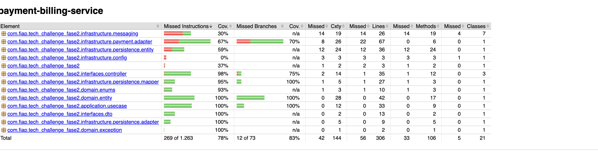

# Payment & Billing Microservice (`payment-billing-service`)

Serviço responsável pela geração de cobranças, processamento de pagamentos integrados ao Mercado Pago (PIX) e recebimento de webhooks de notificação financeira no fluxo da oficina mecânica.

> [!IMPORTANT]
> **Inicialização e Execução**: As instruções completas para inicialização, execução local e implantação em ambiente Kubernetes deste microsserviço e do ecossistema encontram-se documentadas no repositório [**oficina-infra**](https://github.com/CarlosDanyel/oficina-infra).

---

## 🛠️ Tecnologias Utilizadas

- **Linguagem & Framework**: Java 17, Spring Boot 3.3.5
- **Persistência de Dados**: Spring Data JPA, MySQL 8, Flyway Migrations
- **Mensageria**: RabbitMQ (Spring AMQP)
- **Integração Financeira**: Mercado Pago SDK Java
- **Documentação de API**: OpenAPI 3 / Swagger UI (`springdoc-openapi`)
- **Testes & Cobertura**: JUnit 5, Mockito, Cucumber (BDD), JaCoCo
- **Containerização & Orquestração**: Docker, Kubernetes (Kustomize)

---

## 📐 Documentação da Arquitetura do Serviço

Projetado seguindo a **Arquitetura Hexagonal (Ports and Adapters)** garantindo o isolamento total do domínio financeiro e desacoplamento das dependências externas.

### Estrutura de Pacotes

```text
com.fiap.tech_challenge_fase2/
├── domain/            # Payment Entity, PaymentStatus Enum, Value Objects
├── application/       # Use Cases (ProcessPaymentUseCase), Ports (In/Out)
├── infrastructure/    # Mercado Pago Adapter, MySQL JPA Adapter, RabbitMQ Event Publisher
└── interfaces/        # PaymentController (REST API), DTOs, GlobalExceptionHandler
```

### Participação no Saga Pattern (Coreografado)

O `payment-billing-service` atua como um **participante reativo** no ecossistema do Saga Pattern Coreografado:

- **Geração de Cobrança**: Recebe solicitações de cobrança PIX via API REST e cria o pagamento no Mercado Pago.
- **Processamento de Webhooks**: Recebe callbacks do Mercado Pago com o status atualizado e consulta o status autoritativo.
- **Publicação de Eventos**: Notifica o resultado para avanço ou rollback do fluxo da Ordem de Serviço.

#### Eventos Publicados

| Evento | Routing Key | Fila RabbitMQ | Ação |
|---|---|---|---|
| `PaymentApprovedEvent` | `payment.approved` | `payment.approved.queue` | Notifica a aprovação para avanço do fluxo da Ordem de Serviço |
| `PaymentFailedEvent` | `payment.failed` | `payment.failed.queue` | Aciona a compensação/rollback da Ordem de Serviço (`CANCELED`) |

---

## 📊 Evidências de Cobertura de Testes

Os testes unitários e BDD garantem a confiabilidade do serviço com cobertura superior a 80% exigidos pela pipeline de CI/CD.

```bash
# Executar a suíte completa de testes e gerar o relatório JaCoCo
./mvnw clean verify
```

### Relatório de Cobertura de Testes (JaCoCo)



---

## 🔧 Configuração de Ambiente

Para rodar o serviço localmente, é necessário configurar as variáveis de ambiente:

- **Docker (raiz do projeto)**: Crie um arquivo `.env` baseado no [`.env.example`](./.env.example) na raiz do projeto.
- **Kubernetes**: Crie um arquivo `.env` baseado no [`.env.example`](./k8s/.env.example) dentro do diretório [`k8s/`](./k8s/).

As variáveis incluem credenciais do MySQL, RabbitMQ e token de acesso do Mercado Pago.

> [!NOTE]
> Para instruções detalhadas de implantação e inicialização, consulte o repositório [**oficina-infra**](https://github.com/CarlosDanyel/oficina-infra).

---

## 📑 Swagger UI e Coleção Postman

### 1. Documentação Swagger UI / OpenAPI

Quando o serviço estiver em execução (localmente ou via port-forward no Kubernetes):

- **Swagger UI**: [http://localhost:8081/swagger-ui.html](http://localhost:8081/swagger-ui.html)
- **OpenAPI Spec (JSON)**: [http://localhost:8081/api-docs](http://localhost:8081/api-docs)
- **Health Check**: [http://localhost:8081/actuator/health](http://localhost:8081/actuator/health)

### 2. Coleção do Postman

A coleção do Postman para testes do ecossistema encontra-se no repositório:

- 📬 **[postman_collection.json](./postman_collection.json)**
